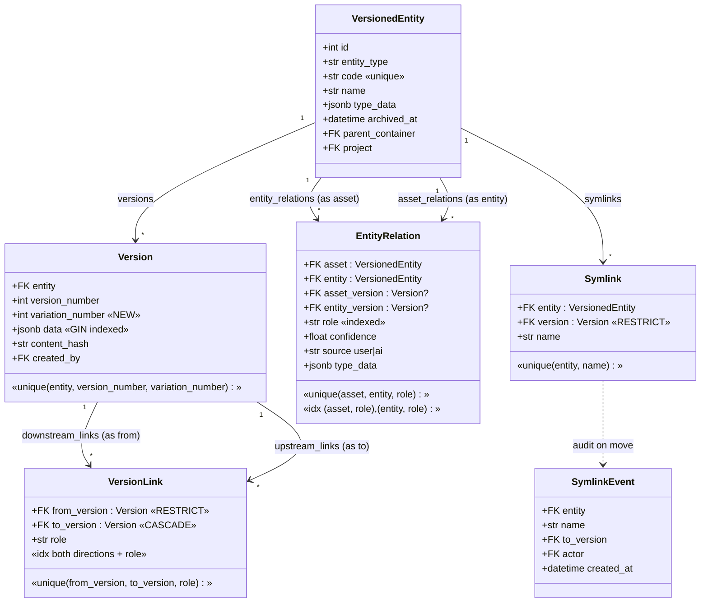
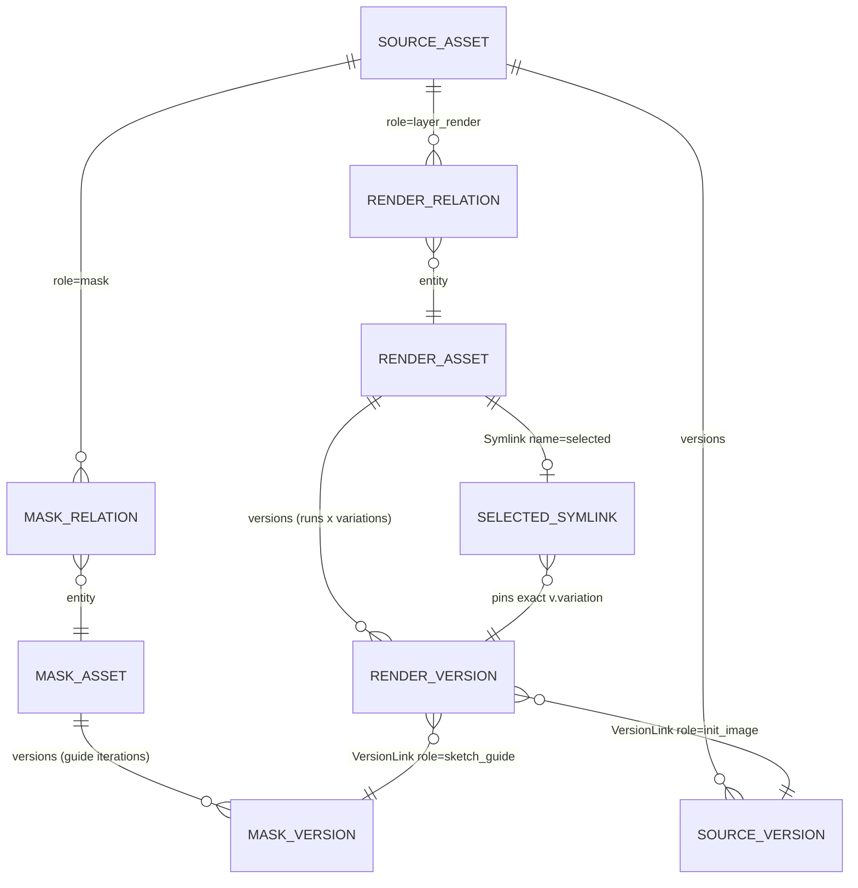
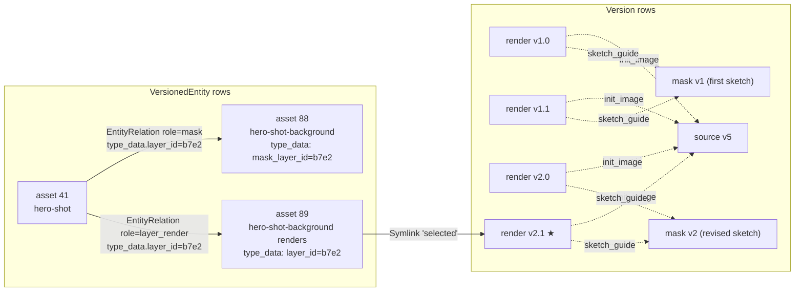
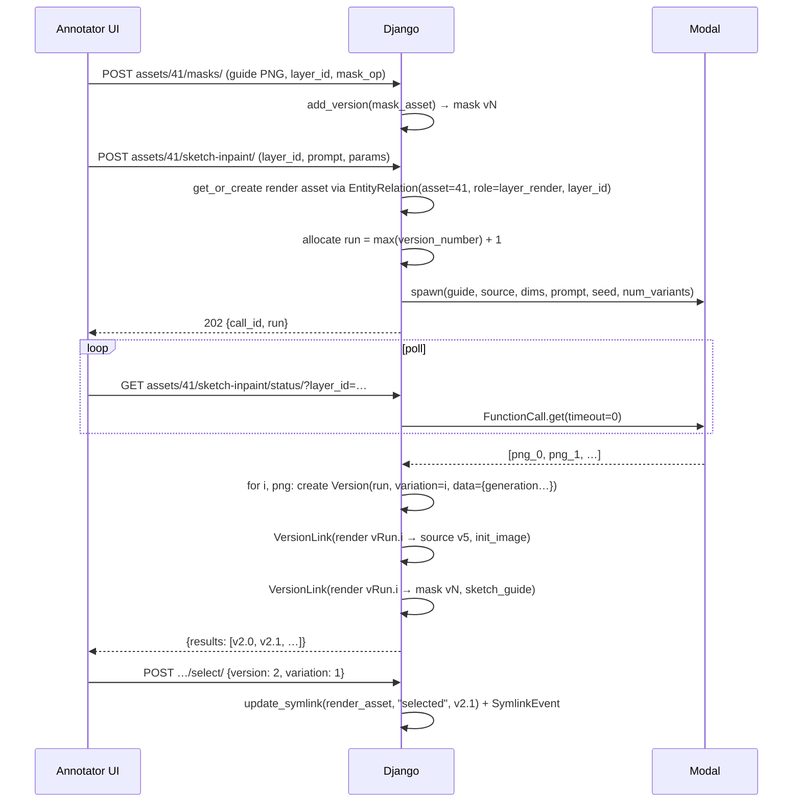

# Layer Render Schema — Versions × Variations

Design for storing AI-generated renders (sketch-inpaint, scribble, erase) produced
from mask layers in the annotator. Replaces the current per-variant-slot preview
assets whose regenerations stack as versions with overwritten provenance.

**Core idea:** one *render asset* per (source asset, mask layer). Each generation
run is a `version_number`; each parallel candidate within a run is a
`variation_number`. Every render is an immutable `Version` row carrying its own
generation parameters, linked by `VersionLink` to the exact input versions that
produced it. No new tables — the design is composed entirely from existing
models plus the `variation_number` axis added in migration 0014.

---

## 1. Model overview (UML)

Models involved. Only `Version.variation_number` is new (migration 0014);
everything else already exists.



---

## 2. The render graph

How one source asset, its mask layers, and their renders connect. Layers are
**not** DB entities — a layer exists as a `crypto.randomUUID()` in the
annotation doc's CRDT state, echoed into `type_data` on the assets and
relations that serve it.



Both relations carry `type_data.layer_id` (the layer UUID), which scopes them
to their layer. The unique constraint `(asset, entity, role)` plus one
render/mask asset per layer keeps this a strict one-row-per-layer mapping.

### Roles used

| Edge | Table | Role | Meaning |
|---|---|---|---|
| source → mask asset | `EntityRelation` | `mask` | layer's guide bitmap (existing `MASK_ROLE`) |
| source → render asset | `EntityRelation` | `layer_render` | layer's render stack (replaces `sketch_inpaint_preview` / `scribble_preview` slots) |
| render version → source version | `VersionLink` | `init_image` | exact source pixels generated from |
| render version → mask version | `VersionLink` | `sketch_guide` | exact guide bitmap used |
| render asset → render version | `Symlink` | `selected` | the artist's chosen render (moves are audited via `SymlinkEvent`) |

---

## 3. Version × variation semantics

Each **dispatch** allocates the next `version_number` (the *run*). Each PNG the
run returns becomes a variation under that run. `Version.data` on every
variation is self-contained provenance, written once, never overwritten.

```
render asset: "hero-shot — background renders"          Symlink "selected"
                                                              │
        variation 0     variation 1     variation 2           ▼
run 1   [ v1.0 ]        [ v1.1 ]                         (points at v2.1)
run 2   [ v2.0 ]        [ v2.1 ]★       [ v2.2 ]
run 3   [ v3.0 ]
        ── runs iterate downward; variations are parallel siblings ──
```

`Version.data` per render:

```jsonc
{
  "file": "media/.../render-v2.1.png",
  "generation": {
    "op": "sketch_inpaint",            // sketch_inpaint | scribble | erase
    "run_seed": 1834729,               // base seed of the run
    "seed": 1834730,                   // this variation's seed (base + index)
    "prompt": "misty forest at dawn",
    "negative_prompt": "",
    "controlnet_scale": 0.4,
    "guidance_scale": 7.5,
    "num_inference_steps": 20,
    "denoise_strength": 1.0,
    "mask_dims": {"x": 120, "y": 80, "w": 640, "h": 480},
    "reference": "asset://342",        // optional IP-Adapter ref
    "reference_scale": 0.5,
    "modal_call_id": "fc-abc123",
    "latency_s": 8.42
  }
}
```

Run-level facts (prompt, scales) are duplicated across a run's variations
deliberately: each `Version` row is a complete, standalone record, and the
existing GIN index on `Version.data` makes containment queries
(`data__contains={"generation": {"seed": 1834730}}`) indexed with no schema
change.

---

## 4. Worked example (object diagram)

Source photo `hero-shot` (asset 41, currently at v5). Artist has a
"background" layer (uuid `b7e2…`) and ran sketch-inpaint twice.



Run 1 (v1.0, v1.1) used the first sketch; the artist revised the sketch (mask
v2) and ran again (v2.0, v2.1). The `sketch_guide` links record which renders
came from which sketch — no need to make version increments "semantic". The
artist picked v2.1; the symlink pins it and `SymlinkEvent` logs the choice.

---

## 5. Write path



Dispatch-state bookkeeping (`call_id`, `dispatched_at`, `status`) stays on the
render relation's `type_data` — it is transient coordination state, not
provenance, and is superseded once the run's `Version` rows exist.

---

## 6. Query paths and index coverage

| Query | Path | Index used |
|---|---|---|
| Layer's render asset | `EntityRelation` on `(asset, role)`, match `layer_id` in the few resulting rows | `relation_asset_role_idx` |
| Contact sheet (all renders for a layer) | `render_asset.versions.all()` | `Version.entity` FK |
| One run's variations | `.filter(version_number=run)` | unique `(entity, version_number, variation_number)` |
| Selected render | `Symlink` `(entity, name="selected")` | `unique_symlink_per_entity` |
| Render → inputs (provenance) | `render_version.upstream_links` (render is `to_version`) | `(to_version, role)` |
| Source version → dependent renders | `source_version.downstream_links.filter(role="init_image")` | `(from_version, role)` |
| Filter renders by seed/prompt | `versions.filter(data__contains={…})` | `version_data_gin` (containment only — **not** `data__seed=` path lookups) |
| All layers with renders for a source | `EntityRelation` on `(asset, role=layer_render)` | `relation_asset_role_idx` |

**Rule: never enter through `MediaAsset.type_data`.** The current
`_mask_lookup` (`type_data__mask_of_asset_id=…`) is an un-indexed sequential
scan over the whole entity table on every dispatch and poll. All lookups above
start from an FK-indexed edge instead. `type_data.layer_id` mirrors remain on
the assets for debuggability, not as query keys.

---

## 7. Retention and deletion semantics

- **Renders are immutable** — one `Version` row each, never re-published.
- **Inputs are protected**: `VersionLink.from_version` is `RESTRICT`, so a
  source or mask version cannot be deleted while renders derived from it exist.
- **The selected render is protected**: `Symlink.version` is `RESTRICT` —
  move the symlink before deleting.
- **Discarding a whole layer's history**: archive the render asset
  (`archived_at`), which is the system-wide convention; hard-deleting the
  asset cascades its versions, and those versions' lineage edges cascade with
  them (`VersionLink.to_version` is `CASCADE`).

---

## 8. Delta from current implementation

| Today | This design |
|---|---|
| One preview asset per (source, layer, **variant index**); regeneration stacks versions per slot | One render asset per (source, layer); runs × variations on a single version grid |
| Params on relation `type_data`, overwritten every dispatch | Params in each render's `Version.data`, immutable |
| Relation `entity_version` bumped to latest — only newest render addressable | Every render addressable as `vN.M`; selection is an audited symlink |
| Source version recorded only on the mask save | `VersionLink` per render to exact source + guide versions |
| Stale variant-slot assets when `num_variants` shrinks | Runs have however many variations they have |
| `type_data` JSONB seq-scans on every lookup | FK-indexed entry via `EntityRelation` |
| No reproduction story | Compatible with `reproduction_manifest`-style walks over `VersionLink` |

### Build status (implemented July 29 2026)

1. ✅ `add_version(…, version_number=None, variation=0, extra_data=None,
   upstream=None)` in [ingest.py](nexus8/trackables/services/ingest.py);
   `publish()` gained the same grid placement under the entity lock.
2. ✅ Run allocation under `select_for_update` in
   [services/layer_renders.py](nexus8/trackables/services/layer_renders.py) —
   the shared store path (get-or-create render asset, variation storage,
   lineage links, selection, grid query). Allocation happens at store time
   (first successful poll) inside one transaction; `add_version`'s
   content-hash dedup makes concurrent-poll double-stores idempotent.
3. ✅ All four generation paths converted: sketch-inpaint, scribble, erase,
   and inpaint ([views_inpaint.py](nexus8/trackables/views_inpaint.py)).
   Status payloads keep the legacy SPA shape with grid coordinates added;
   legacy per-slot records still render.
4. ✅ `POST …/renders/select/` + `GET …/renders/` (contact sheet) in
   [views_renders.py](nexus8/trackables/views_renders.py).
5. ✅ Contact sheet UI:
   [RenderHistoryPanel.tsx](web/src/features/annotator/components/RenderHistoryPanel.tsx)
   — collapsible runs × variations grid under the layer detail panel; click
   previews on canvas, star pins the selection.
6. ✅ `_mask_lookup` enters via the relation edge; legacy masks fall back to
   the JSONB path once and are healed in place (`layer_id` stamped on the
   relation). `MaskSaveView` writes `layer_id` on the mask relation.

Legacy stacked-version preview assets are left as-is (experimental data, not
worth backfilling).
